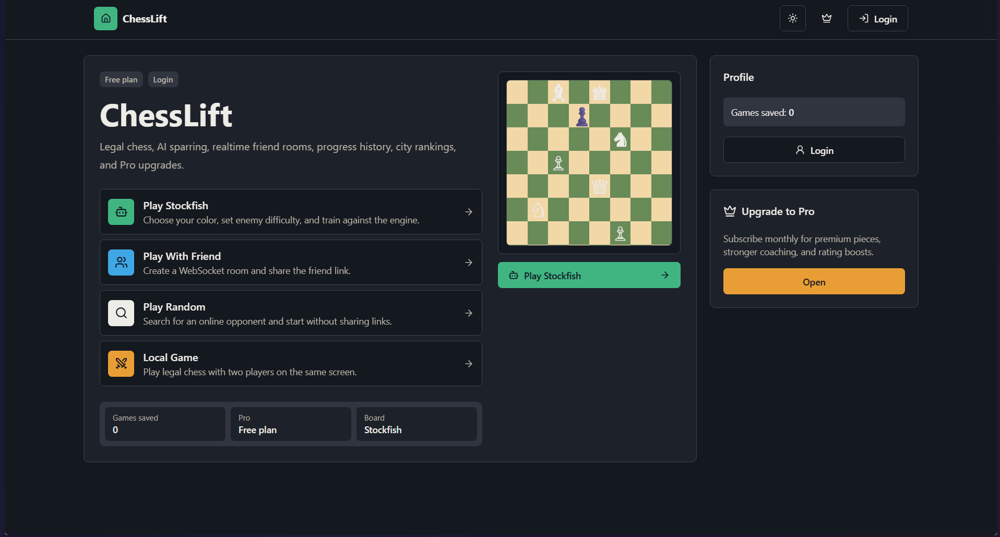
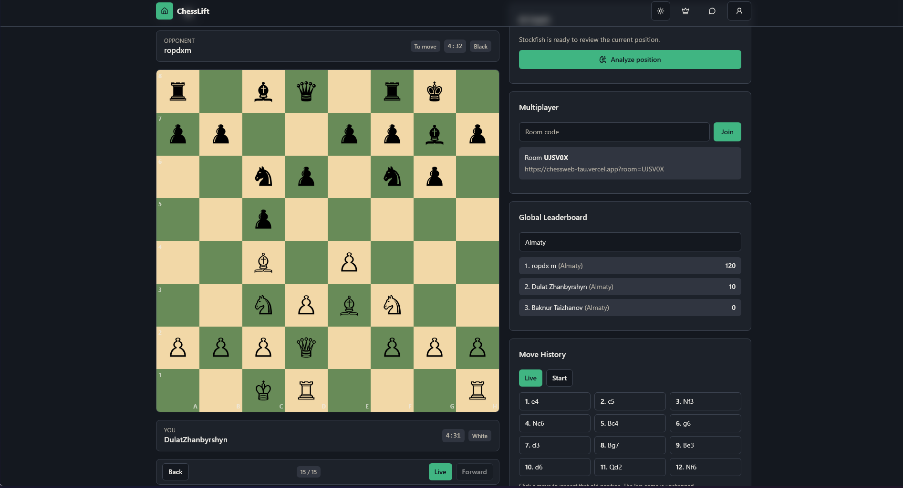
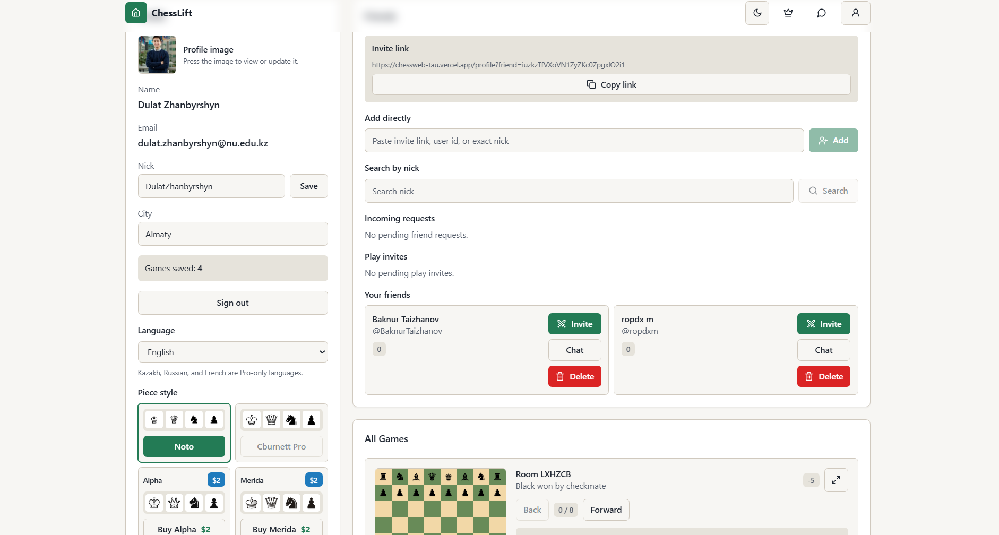
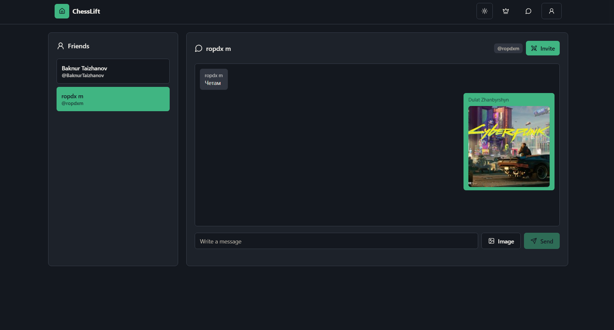
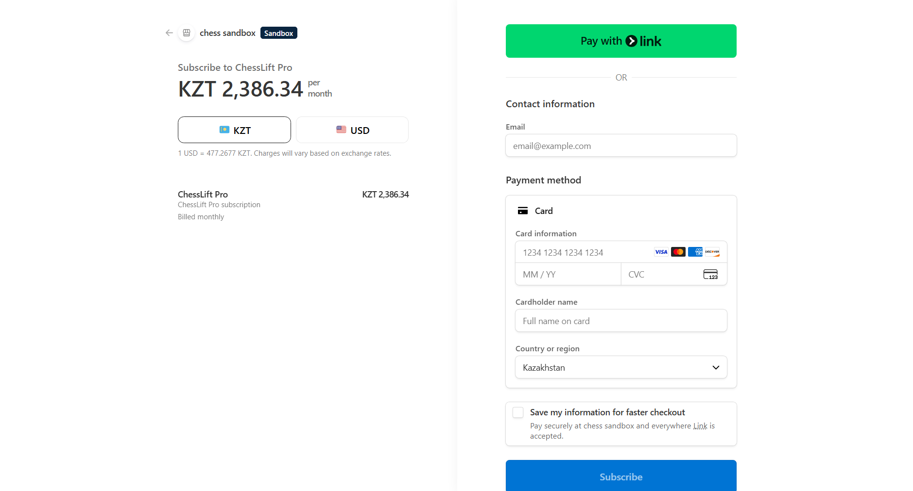

# ChessLift

ChessLift is a full-stack chess training and multiplayer web app. It combines legal chess play, AI practice, realtime friend rooms, saved game replays, player profiles, friend requests, chat, image uploads, leaderboards, and Stripe-powered Pro upgrades.

## Короткое описание продукта

ChessLift - это веб-приложение для игры и тренировки в шахматы. Мы сделали платформу, где пользователь может играть локально, против Stockfish, со случайным соперником или с другом по приглашению, сохранять партии, смотреть повторы, добавлять друзей, общаться в чате и отслеживать прогресс через профиль и рейтинг.

Продукт создан для шахматистов-любителей и начинающих игроков, которым нужен удобный способ быстро сыграть партию, получить практику с AI, вернуться к истории игр и играть с друзьями без сложной настройки.

Ценность ChessLift в том, что он объединяет игру, обучение, социальные функции и прогресс в одном месте: пользователь не просто играет партию, а видит свою историю, развивает рейтинг, приглашает друзей и получает больше причин возвращаться к тренировкам.

## Screenshots

### Home dashboard



### Multiplayer chess board



### Profile, friends, and saved games



### Friend chat with image messages



### Stripe checkout for Pro



## Features

- Legal chess moves and game-state validation with `chess.js`.
- Local same-screen games.
- Stockfish practice mode with adjustable AI difficulty.
- Browser Stockfish coaching and move analysis.
- Realtime multiplayer through WebSocket rooms.
- Random matchmaking and direct friend-room links.
- Friend system:
  - Add friends by nick search.
  - Add friends by direct invite link.
  - Add friends by pasting an invite link, user id, or exact nick.
  - Accept, decline, and delete friends.
  - Pending outgoing friend requests disable the Add button until accepted or declined.
- Invite friends directly to a live chess game from profile or chat.
- Friend chat page with one-to-one message threads.
- Chat image uploads through Firebase Storage.
- Profile image uploads through Firebase Storage.
- Uploaded profile and chat images are resized client-side to `200x200` JPEGs before storing.
- Profile page with nick, city, language, profile image, piece style, friends, play invites, and saved games.
- Saved game history with replay controls and pagination.
- City leaderboard and rating changes.
- Firebase Auth with email/password and Google sign-in.
- Firestore for profiles, friends, requests, invites, chats, leaderboards, and saved games.
- Firebase Storage rules for profile images and chat images.
- Stripe Checkout for Pro subscriptions and paid piece styles.
- Premium language and piece-style options.

## Technology Stack

- **Next.js App Router** for the frontend application.
- **React 19** and **TypeScript** for UI and type-safe logic.
- **Tailwind CSS** with local shadcn-style UI primitives.
- **lucide-react** for interface icons.
- **chess.js** for chess rules, legal moves, PGN/FEN handling, and game-over states.
- **Stockfish Web Worker** for browser-side chess analysis.
- **Express.js** backend for API routes and WebSocket hosting.
- **ws** for realtime multiplayer rooms and matchmaking.
- **Firebase Auth** for user accounts.
- **Firestore** for realtime user data, friends, game invites, chats, saved games, and leaderboards.
- **Firebase Storage** for profile images and chat images.
- **Stripe** for Pro subscriptions, checkout sessions, billing portal, and paid piece styles.
- **Vercel** for the Next.js frontend deployment.
- **Render** configuration for the backend/WebSocket service.

## Project Structure

- `app/` - Next.js App Router pages.
  - `app/page.tsx` - home dashboard.
  - `app/profile/page.tsx` - profile route powered by `ChessApp`.
  - `app/chat/page.tsx` - friend chat page.
  - `app/play/*` - chess play routes.
  - `app/pro/page.tsx` - Pro subscription page.
- `components/` - app UI and reusable components.
  - `components/chess-app.tsx` - main chess, profile, saved games, friends, and multiplayer UI.
  - `components/app-navbar.tsx` - top navigation.
  - `components/ui/*` - shadcn-style UI primitives.
- `lib/`
  - `lib/firebase.ts` - Firebase Auth, Firestore, Storage, friends, chats, invites, uploads, profiles, and saved games.
  - `lib/stockfish.ts` - Stockfish worker wrapper.
  - `lib/stripe.ts` - Stripe frontend helpers.
  - `lib/i18n.ts` - app translations.
- `server/index.ts` - Express API, Stripe endpoints, WebSocket rooms, clocks, and matchmaking.
- `public/stockfish-worker.js` - browser Stockfish worker.
- `storage.rules` - Firebase Storage permissions for avatars and chat images.
- `firebase.json` - Firebase Storage rules config.
- `render.yaml` - backend deployment config.

## Local Setup

1. Install dependencies:

```bash
npm install
```

2. Create `.env.local` with the Firebase, Stripe, API, and WebSocket values your deployment needs.

3. Start the frontend and backend together:

```bash
npm run dev
```

4. Open the frontend:

```text
http://localhost:3001
```

The backend runs on port `4000` by default.

## Environment Variables

Frontend Firebase:

```bash
NEXT_PUBLIC_FIREBASE_API_KEY=
NEXT_PUBLIC_FIREBASE_AUTH_DOMAIN=
NEXT_PUBLIC_FIREBASE_PROJECT_ID=
NEXT_PUBLIC_FIREBASE_STORAGE_BUCKET=
NEXT_PUBLIC_FIREBASE_MESSAGING_SENDER_ID=
NEXT_PUBLIC_FIREBASE_APP_ID=
NEXT_PUBLIC_FIREBASE_MEASUREMENT_ID=
```

Frontend API and realtime endpoints:

```bash
NEXT_PUBLIC_API_URL=http://localhost:4000
NEXT_PUBLIC_WS_URL=ws://localhost:4000
```

Stripe:

```bash
NEXT_PUBLIC_STRIPE_PUBLISHABLE_KEY=
STRIPE_SECRET_KEY=
STRIPE_WEBHOOK_SECRET=
```

Backend:

```bash
PORT=4000
CLIENT_ORIGIN=http://localhost:3001
```

## Firebase Setup

Enable these Firebase products:

- Authentication: Email/password and Google provider.
- Firestore Database.
- Firebase Storage.

Deploy Storage rules:

```bash
firebase deploy --only storage
```

`storage.rules` allows authenticated users to upload their own profile image and allows chat image access only for users listed as participants in the corresponding chat document.

## Scripts

- `npm run dev` - run Next.js and the Express/WebSocket server together.
- `npm run dev:web` - run only the Next.js frontend on port `3001`.
- `npm run dev:server` - run only the backend with `tsx watch`.
- `npm run build` - build the Next.js frontend.
- `npm run build:server` - compile the backend TypeScript.
- `npm run start` - start the built Next.js frontend on port `3001`.
- `npm run server` - run the backend directly with `tsx`.
- `npm run start:server` - run the compiled backend from `dist/server/index.js`.

## Multiplayer Notes

Friend invites create a requested room id and send the friend a `/play/friend?room=ROOMID` link. The inviter is routed to `/play/friend?hostRoom=ROOMID`, which creates that exact WebSocket room. The server assigns the first connected player to white and the second to black, and rejects extra joiners with `Room is full`.

Player display names prefer the saved profile nick, then profile name, then account display name or email.

## Image Uploads

Profile and chat image uploads are resized in the browser before upload:

- Cropped square from the center of the image.
- Resized to `200x200`.
- Stored as JPEG.
- Uploaded to Firebase Storage.

Profile images are stored at:

```text
users/{userId}/avatar.jpg
```

Chat images are stored at:

```text
chats/{threadId}/{timestamp-random}.jpg
```

## Piece Assets

Piece styles use freely licensed SVG assets from Wikimedia Commons and Lichess:

- Cburnett chess pieces: available under licenses listed on each Wikimedia file page, including CC BY-SA 3.0 and BSD/GFDL/GPL options.
- Noto Sans Symbols2 chess glyph SVGs: SIL Open Font License 1.1.
- Alpha, Merida, California, Cardinal, and Pixel purchasable piece styles use Lichess open-source piece assets from the AGPL-licensed lila repository.
